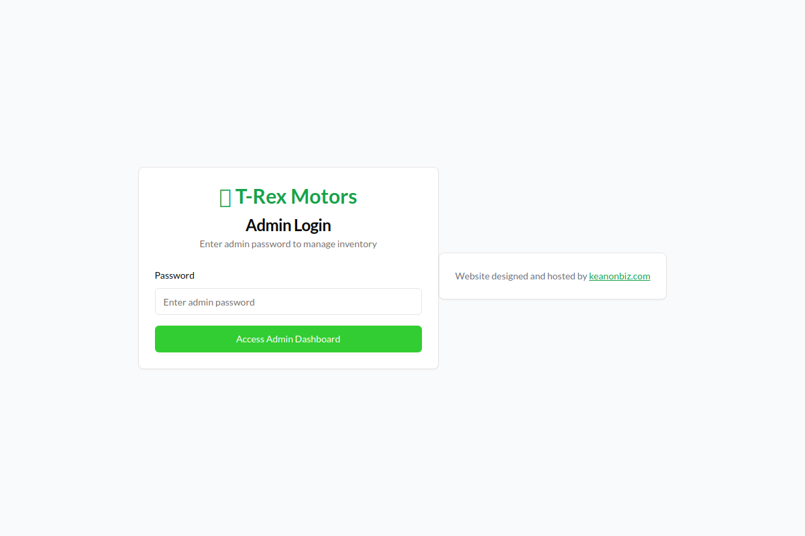
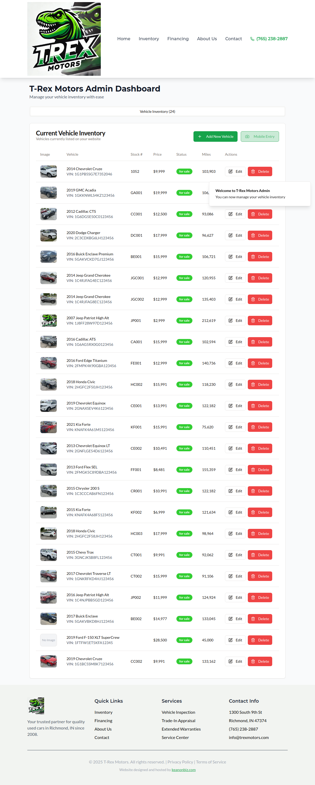
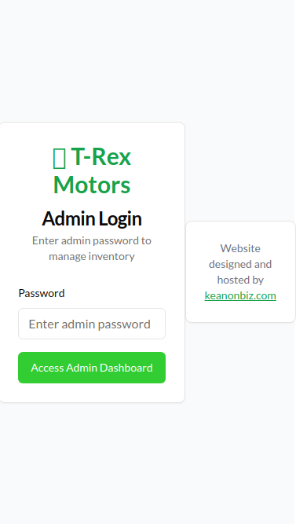

# 🦖 T-Rex Motors Complete Admin Guide

**Everything You Need to Know About Managing Your Car Website**

## Quick Start
This guide will teach you how to add cars to your website in simple steps. You don't need to be a computer expert - we'll walk through everything together!

---

## 🏠 Getting Started

### What You'll See First

When you go to your website and add "/admin" to the end, you'll see this login screen:

Just type **admin** as the password and click the green button.

### Your Main Dashboard

After logging in, you'll see your main dashboard with all your cars:

This shows:
- **Green "Add New Vehicle" button** - Click this to add cars from your computer
- **"Mobile Entry" button** - Click this to add cars from your phone
- **Your car list** - All the cars currently on your website
- **Edit buttons** - Click "Edit" next to any car to change its details

---

## 🖥️ Adding Cars from Computer (Desktop Method)

### When to Use This Method
- When you're at your desk or office
- When you have all car details and photos ready
- When you want to add complete information at once

### Step-by-Step Instructions

1. **Click the Green Button**
   Look for "Add New Vehicle" button at the top right

2. **Fill Out the Form**
   A big form will open with these important fields:
   
   **Required Fields (Must Fill Out):**
   - Make: Toyota, Ford, Chevrolet, etc.
   - Model: Camry, F-150, Cruze, etc.
   - Year: 2015, 2018, 2020, etc.
   - Price: Just the number (like 15000)
   - Mileage: Miles on the car
   - VIN: The car's ID number
   - Stock Number: Your inventory number
   - Colors: Both exterior and interior
   - Description: Tell people about the car

3. **Add Photos**
   - Scroll down to "Vehicle Images"
   - Click "Choose Files" to upload from your computer
   - Or paste web addresses if your photos are online
   - Add as many photos as you want
   - The first photo becomes the main picture

4. **Save the Car**
   Click "Create Vehicle" at the bottom
   Your car appears on the website immediately!

---

## 📱 Adding Cars from Phone (Mobile Method)

### When to Use This Method
- At car auctions
- When you're away from your office
- For quick car entries with photos

### Mobile View
When you use your phone, the interface looks like this:

### Step-by-Step Instructions

1. **Install the App (First Time Only)**
   - Open your website on your phone
   - Go to /admin and log in with "admin"
   - Look for "Add to Home Screen" or "Install App"
   - This creates an app icon on your phone
   - Works even without internet!

2. **Quick Car Entry**
   - Open the app or website on your phone
   - Click "Mobile Entry" or "Quick Entry" button
   - You'll see a simple form perfect for phones

3. **Take Photos**
   - Click the camera button
   - Take pictures of:
     - Front of car
     - Back of car  
     - Both sides
     - Interior
     - Engine (if possible)
   - Photos are automatically saved

4. **Fill Basic Info**
   Type in the most important details:
   - Make and Model
   - Year
   - Your asking price
   - Mileage (if you can see it)
   - Auction house name
   - Lot number

5. **Save from Phone**
   - Click "Save Vehicle"
   - Car goes live on your website instantly!
   - GPS location is automatically saved

---

## ✏️ Editing Cars Already on Your Website

### Finding Cars to Edit
1. Scroll down on your dashboard
2. You'll see a table with all your cars
3. Each row has car details and buttons on the right

### Making Changes
1. **Click "Edit"** next to the car you want to change
2. **Change any details** you want:
   - Update the price
   - Add more photos
   - Change the description
   - Mark as "SOLD"
3. **Click "Update Vehicle"** to save changes

### Common Edits
- **Price Changes**: Just type the new price
- **Adding Photos**: Upload more pictures
- **Marking as SOLD**: Change status to "SOLD"
- **Updating Description**: Add more details about the car

---

## ❌ What to Do When Cars Are Sold

### Option 1: Mark as SOLD (Recommended)
- Edit the car
- Change status to "SOLD"
- Car stays on website but shows as sold
- Helps build trust with customers

### Option 2: Delete Completely
- Click the red trash can button
- Car is removed from website forever
- **Warning**: This can't be undone!

---

## 🔧 Common Problems and Solutions

### "I Can't Log In"
**Solutions:**
- Make sure you type "admin" (all lowercase)
- Check that you added "/admin" to your website address
- Try refreshing the page
- Clear your browser cache

### "My Photos Won't Upload"
**Solutions:**
- Make sure photos are smaller than 5MB each
- Use JPG or PNG photos only
- Check your internet connection
- Try uploading one photo at a time

### "The Mobile App Isn't Working"
**Solutions:**
- Make sure you installed it properly (see mobile section)
- Try closing and reopening the app
- Check if you have internet connection
- Restart your phone if needed

### "My Car Isn't Showing on the Website"
**Solutions:**
- Wait 2-3 minutes (sometimes takes a moment)
- Refresh your website in a new browser tab
- Make sure you clicked "Create Vehicle" or "Update Vehicle"
- Check that all required fields were filled out

### "I Made a Mistake"
**Solutions:**
- Find the car in your dashboard
- Click "Edit" next to it
- Make your changes
- Click "Update Vehicle" to save

---

## 📋 Before Adding Any Car - Checklist

Make sure you have:
- ✅ **Make and Model** (Toyota Camry)
- ✅ **Year** (2020)
- ✅ **Price** (what you want to sell it for)
- ✅ **At least one photo** (more is better!)
- ✅ **VIN number** (if available)
- ✅ **Mileage** (if you can see it)
- ✅ **Basic description** (anything special about the car)

---

## 🎯 Tips for Success

### Taking Great Photos
- **Clean the car first** if possible
- **Take photos in good light** (not too dark)
- **Show the whole car** in the first photo
- **Include interior shots** (dashboard, seats)
- **Highlight any special features**

### Writing Descriptions
- **Keep it simple** and honest
- **Mention good features** (new tires, recent service)
- **Be upfront about any issues**
- **Include extra features** (leather seats, navigation, etc.)

### Pricing Cars
- **Research similar cars** online
- **Consider the car's condition**
- **Leave room for negotiation**
- **Update prices if cars aren't selling**

---

## 📞 Getting Help

### If You Get Stuck
- **Call**: 765-238-2887
- **Email**: info@trexmotors.com
- **Address**: 1300 South 9th St, Richmond, IN 47374

### What to Include When Asking for Help
- **Take a screenshot** of any error messages
- **Describe what you were trying to do**
- **Tell us what happened** vs what you expected
- **Mention if it worked before** or if this is the first time

**We're here to help make this easy for you!**

---

## 🚀 Advanced Features (Optional)

### Vehicle History Reports
- Some cars may have CARFAX or AutoCheck reports
- These show up automatically if available
- Helps customers trust your cars

### Inventory Management
- Mark cars as "Pending" when someone is interested
- Use "SOLD" status to show successful sales
- Keep track of which cars sell fastest

### Customer Inquiries
- Customers can contact you through the website
- You'll get emails when someone is interested
- Include your phone number for faster responses

---

*Last updated: January 2025 | T-Rex Motors Admin System v2.0*

*This guide was created to be as simple as possible. If anything is confusing, please call us and we'll help you through it!*