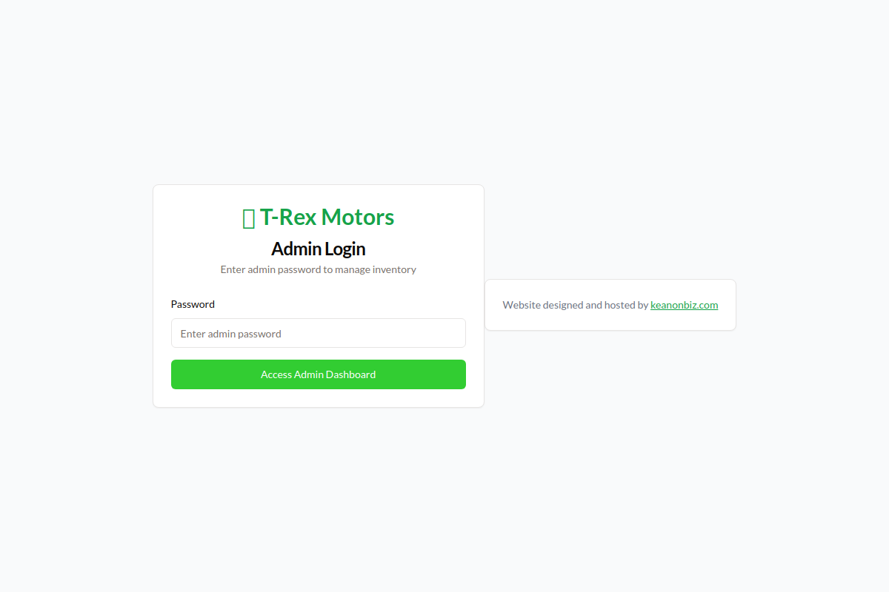
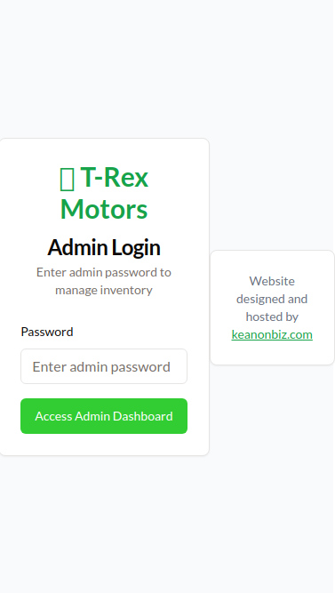

# 🦖 T-Rex Motors Admin User Guide

**Simple Steps to Add Cars to Your Website**

## 📞 Need Help?
- **Phone:** 765-238-2887
- **Email:** info@trexmotors.com  
- **Address:** 1300 South 9th St, Richmond, IN 47374

---

## 🏠 Getting Started - How to Log In

### Step 1: Open Your Website
Go to your T-Rex Motors website and add "/admin" to the end of the web address.

### Step 2: Enter Password  
Type the password: **admin**

### Step 3: You're In!
You'll see the admin dashboard with your car inventory.

---

## 🖥️ Adding Cars from Your Computer

### Step 1: Click "Add New Vehicle"
Look for the green button that says **+ Add New Vehicle**

### Step 2: Fill Out Car Information
A big form will open. Fill in all the boxes with your car's details:
- **Make:** Toyota, Ford, Chevrolet, etc.
- **Model:** Camry, F-150, Cruze, etc.  
- **Year:** 2015, 2018, etc.
- **Price:** Just type the number (like 15000)
- **Miles:** How many miles on the car
- **VIN:** The car's ID number
- **Stock Number:** Your inventory number

### Step 3: Add Photos
Scroll down to the "Vehicle Images" section. You can:
- Type in web addresses of photos
- Click "Choose Files" to upload from your computer  
- Add multiple photos - the first one will be the main photo

### Step 4: Save Your Car
Click the green **Create Vehicle** button at the bottom.

> **💡 Tip:** Your car will appear on the website immediately after you save it!

---

## 📱 Adding Cars from Your Phone (At Auctions)

### Step 1: Install the App on Your Phone
First time only:
- Open your website on your phone
- Go to /admin and log in
- Look for "Add to Home Screen" or "Install App"
- This lets you use it even without internet!

### Step 2: Click "Mobile Entry" or "Quick Entry"
Look for the button with the camera icon

### Step 3: Take Photos
Click the camera button to take pictures of the car. Take photos of:
- Front of the car
- Back of the car
- Both sides
- Inside (dashboard, seats)
- Engine (if possible)

### Step 4: Fill Out Basic Info
Type in the important details:
- Make and Model
- Year
- Price you want to ask
- Miles (if you can see it)
- Auction house name
- Lot number

### Step 5: Save from Auction
Click **Save Vehicle** and the car goes live on your website!

> **📍 Cool Feature:** The app automatically saves where you are (GPS location) so you remember which auction you got the car from!

---

## ✏️ Editing Cars Already on Your Website

### Step 1: Find Your Car
On the admin dashboard, scroll down to see all your cars in a list.

### Step 2: Click "Edit"
Find the car you want to change and click the blue "Edit" button.

### Step 3: Make Changes
Change the price, add more photos, update the description, or mark it as "SOLD".

### Step 4: Save Changes
Click **Update Vehicle** when you're done.

---

## ❌ Removing Cars (When Sold)

### Option 1: Mark as SOLD
Edit the car and change the status to "SOLD" - this keeps it on the website but shows it's sold.

### Option 2: Delete Completely  
Click the red trash can button to remove it completely from the website.

> **⚠️ Warning:** If you delete a car, it's gone forever! Consider marking it as "SOLD" instead.

---

## 🔧 Troubleshooting

### Problem: "I can't log in"
- Make sure you're typing "admin" (all lowercase)
- Make sure you added "/admin" to the end of your website address
- Try refreshing the page

### Problem: "My photos won't upload"
- Make sure your photos aren't too big (should be under 5MB each)
- Try using JPG or PNG photos
- Make sure you have good internet connection

### Problem: "The mobile app isn't working"
- Make sure you installed it properly (see Step 1 in Mobile section)
- Try closing and reopening the app
- Check if you have internet connection

### Problem: "My car isn't showing on the website"
- Wait 2-3 minutes - sometimes it takes a moment
- Refresh your website
- Make sure you clicked "Create Vehicle" or "Update Vehicle"

---

## 📋 Quick Checklist for Adding Cars

**Before you save any car, make sure you have:**
- ✅ Make and Model filled in
- ✅ Year filled in
- ✅ Price filled in
- ✅ At least one photo uploaded
- ✅ VIN number (if you have it)
- ✅ Mileage (if you can see it)

---

## 📞 Getting Help

If you get stuck or something isn't working right:
- **Call:** 765-238-2887
- **Email:** info@trexmotors.com
- **Text:** Take a screenshot of the problem and text it

**We're here to help make this easy for you!**

---

*Last updated: January 2025 | T-Rex Motors Admin System v2.0*